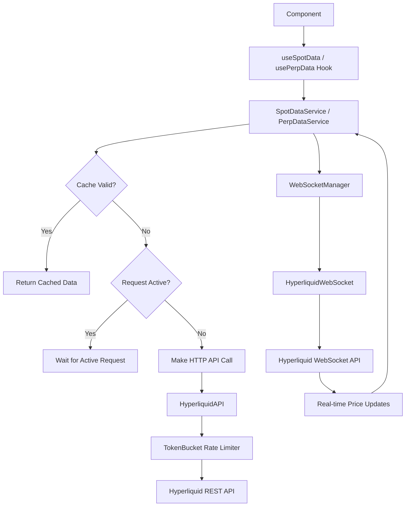

# Bullpen Trading Interface

A real-time trading interface for Hyperliquid markets built with Next.js, TypeScript, and Tailwind CSS.

## Data Feed Architecture

This application implements a sophisticated real-time data system that combines HTTP API calls with WebSocket streams for optimal performance and reliability.

### Overview

The data flow follows this pattern:
1. **Initial Load**: HTTP API fetches market data
2. **Real-time Updates**: WebSocket streams provide live price updates
3. **Caching & Deduplication**: Smart caching prevents unnecessary API calls
4. **Rate Limiting**: Token bucket prevents API abuse

### Core Components

#### WebSocket Manager (`lib/services/websocket-manager.ts`)
Centralized WebSocket connection management using singleton pattern:
- **Connection Pooling**: Single WebSocket connection shared across all services
- **Reference Counting**: Tracks how many services need the connection
- **Auto-reconnection**: Handles disconnections with exponential backoff
- **Status Broadcasting**: Notifies all subscribers of connection state changes

```typescript
// Example usage
webSocketManager.requestConnection()  // Request connection
webSocketManager.releaseConnection()  // Release when done
```

#### Data Services
Two main services handle market data:

**PerpDataService** (`lib/services/perp-data-service.ts`)
- Manages perpetual futures market data
- Fetches initial data via HTTP API
- Subscribes to WebSocket `allMids` for real-time price updates
- Implements 30-second caching with request deduplication

**SpotDataService** (`lib/services/spot-data-service.ts`)
- Manages spot market data
- Similar architecture to PerpDataService
- Filters markets by quote token (USDC)
- Handles token metadata and contract addresses

#### Rate Limiting (`lib/services/token-bucket.ts`)
Implements token bucket algorithm to respect Hyperliquid's API limits:
- **50 tokens maximum** (conservative limit)
- **5 tokens/second refill rate**
- **Request queuing** when rate limit reached

#### API Client (`lib/services/hyperliquid-api.ts`)
HTTP client for Hyperliquid REST API:
- **Built-in rate limiting** using token bucket
- **Timeout handling** (10 seconds)
- **Error handling** with custom error types
- **Asset name mapping** for display purposes

### Data Flow



### Features

#### Request Deduplication
- **Promise Sharing**: Multiple simultaneous requests for the same data share a single promise
- **Cache Validation**: 30-second cache prevents unnecessary API calls
- **Memory Efficiency**: Services reuse existing data when possible

#### Real-time Updates
- **WebSocket Streams**: Live price updates via `allMids` subscription
- **Automatic Reconnection**: Handles network failures gracefully
- **Status Indicators**: Live indicator shows connection status (initializing/live/stale)

#### Error Handling
- **Rate Limit Protection**: Token bucket prevents 429 errors
- **Network Failures**: Automatic retry with exponential backoff
- **Graceful Degradation**: Falls back to cached data when possible

### Performance Optimizations

1. **Single WebSocket Connection**: Shared across all services
2. **Smart Caching**: 30-second cache for API responses
3. **Request Deduplication**: Prevents duplicate API calls
4. **Conservative Rate Limiting**: Stays well below API limits
5. **Memory Efficient**: Services share data and cleanup properly

### Usage Examples

```typescript
// Using the hooks in components
const { markets, loading, error, refresh } = usePerpData()
const { markets: spotMarkets } = useSpotMarketsByQuote('USDC')

// Direct service usage
await perpDataService.fetchMarkets()
perpDataService.onData((markets) => console.log('Updated markets:', markets))
```

### WebSocket Status Management

The application provides real-time connection status through the `useWebSocketStatus` hook:

```typescript
const { isLive, isInitializing, status, lastUpdate } = useWebSocketStatus()
```

**Status States:**
- **Initializing** (gray): Connecting and waiting for first data
- **Live** (green): Connected and receiving fresh data (≤30s old)
- **Stale** (orange): Connected but no recent data (>30s old)
- **Error** (red): Connection failed or timed out

### Project Structure

```
lib/
├── services/
│   ├── websocket-manager.ts      # Centralized WebSocket management
│   ├── hyperliquid-websocket.ts  # WebSocket client implementation
│   ├── hyperliquid-api.ts        # HTTP API client
│   ├── perp-data-service.ts      # Perpetual markets data service
│   ├── spot-data-service.ts      # Spot markets data service
│   └── token-bucket.ts           # Rate limiting implementation
├── hooks/
│   ├── use-websocket-status.ts   # WebSocket status hook
│   ├── use-perp-data.ts          # Perpetual markets hooks
│   └── use-spot-data.ts          # Spot markets hooks
└── types/
    └── hyperliquid-types.ts      # TypeScript type definitions
```

### Design System

- **Global colors**: Defined in OKLCH converted from Figma hex for consistency
- **Typography**: Custom fonts defined in `fonts.css`
- **Icons**: Custom icon components in `/components/icons`
- **Components**: Documented in Storybook for showcase and development
- **State Management**: Persistent tab state using router.replace (no history additions)

This is a [Next.js](https://nextjs.org) project bootstrapped with [`create-next-app`](https://nextjs.org/docs/app/api-reference/cli/create-next-app).

## Getting Started

First, run the development server:

```bash
npm run dev
# or
yarn dev
# or
pnpm dev
# or
bun dev
```

Open [http://localhost:3000](http://localhost:3000) with your browser to see the result.

You can start editing the page by modifying `app/page.tsx`. The page auto-updates as you edit the file.

This project uses [`next/font`](https://nextjs.org/docs/app/building-your-application/optimizing/fonts) to automatically optimize and load [Geist](https://vercel.com/font), a new font family for Vercel.

## Learn More

To learn more about Next.js, take a look at the following resources:

- [Next.js Documentation](https://nextjs.org/docs) - learn about Next.js features and API.
- [Learn Next.js](https://nextjs.org/learn) - an interactive Next.js tutorial.

You can check out [the Next.js GitHub repository](https://github.com/vercel/next.js) - your feedback and contributions are welcome!

## Development

### Available Scripts

```bash
npm run dev          # Start development server
npm run build        # Build for production
npm run start        # Start production server
npm run lint         # Run ESLint checks
npm run storybook    # Start Storybook component documentation
```

### Debugging Data Feed

The data services include comprehensive logging. Open browser console to see:
- WebSocket connection status
- API request caching/deduplication
- Rate limiting token usage
- Real-time data updates

### Troubleshooting

**Rate Limiting (HTTP 429)**
- Services implement request deduplication and 30-second caching
- Token bucket limits to 5 requests/second with 50 token capacity
- Avoid rapid tab switching or manual refresh spamming

**WebSocket Connection Issues**
- Connection automatically reconnects with exponential backoff
- Check browser console for connection status logs
- Live indicator in footer shows real-time connection status

**Missing Data Updates**
- Verify WebSocket status indicator shows "Live" (green)
- Real-time updates depend on `allMids` WebSocket subscription
- Fallback to cached HTTP data if WebSocket fails


- Global colors defined in oklch converted from figma hex for consistency throughout project
- Fonts defined in fonts.css
- Custom icons store in /components/icons
- storybook for component showcasing
- Persistent tab state (router.replace for no history additions)

## Deploy on Vercel

The easiest way to deploy your Next.js app is to use the [Vercel Platform](https://vercel.com/new?utm_medium=default-template&filter=next.js&utm_source=create-next-app&utm_campaign=create-next-app-readme) from the creators of Next.js.

Check out our [Next.js deployment documentation](https://nextjs.org/docs/app/building-your-application/deploying) for more details.
